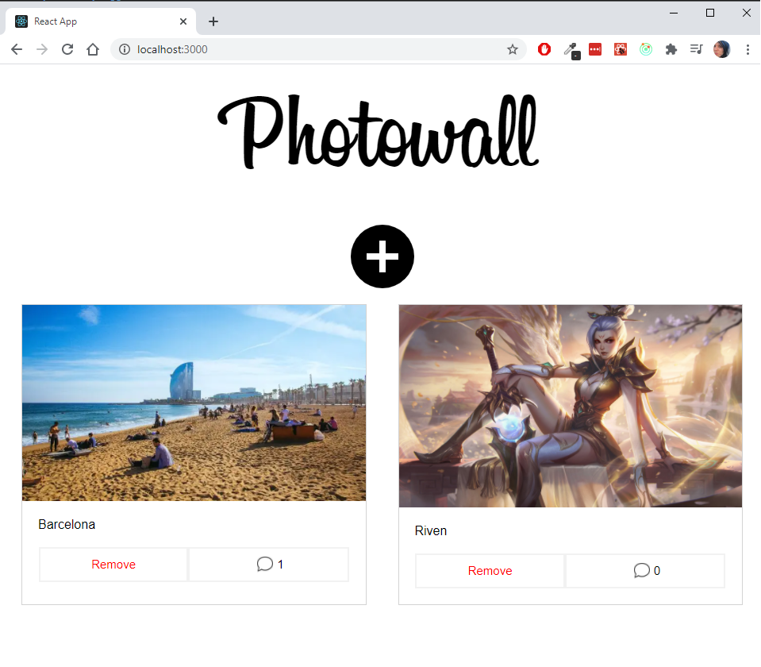

# About Photowall

This is a test project to learn React + redux basics. Will be changing with more knowladge.  
This was posible by Following the Udemy Course [The Complete React Js & Redux Course - Build Modern Web Apps](https://www.udemy.com/course/the-complete-react-js-redux-course-build-modern-web-apps/).

## App Example



What you can do:

- Add photos as links and a caption.
- Add comments to the posts.
- Delete a photo.

## Getting Started with Create React App

This project was bootstrapped with [Create React App](https://github.com/facebook/create-react-app).

## Available Scripts

In the project directory, you can run:

```shell
$ npm install 
$ npm run start
```

Runs the app in the development mode.\
Open [http://localhost:3000](http://localhost:3000) to view it in the browser.

The page will reload if you make edits.

## Firebase Setup

- Go to firebase.google.com, you need a google account. 
- Go to console.
- Create a new project named Photowall
- Modify rules so write and read options are true so we don't need to autthenticate and the reason is the example project is not to learn firebase but react, and use firebase to fetch and store the post data.
- Then create a web-app to connect
- Then install firebase in your project, version 4.8.2 for this project.
- Copy the configuration given in our app database/config.js and that's it.

## Learn More

You can learn more in the [Create React App documentation](https://facebook.github.io/create-react-app/docs/getting-started).
To learn React, check out the [React documentation](https://reactjs.org/).
